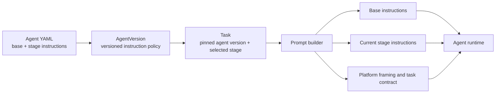

# 33. Stage-specific agent instructions

> **Status: proposed (2026-07-10).** Add optional instructions for each kernel stage while
> keeping the existing agent-wide instructions and platform task contracts.

## Problem

An agent has one `instructions` string today. Marathon applies that string to every task the
agent performs. This works for an agent with one role. It is less precise for Forge, which
drafts design documents, reviews feedback, builds code, and responds to code review.

The shared string creates three problems:

- Every task receives rules for unrelated work. A build task receives document-writing rules.
- Rules for different stages can conflict. A document rule can affect a code response.
- Operators must express each rule as a condition such as "when drafting." The prompt builder
  already knows the current stage, but the configuration cannot use that fact.

Marathon also has hardcoded draft and revision personas in the GitHub handler. They are only
fallbacks. `buildAgentPrompt` replaces them when the task has an `AgentVersion`. Adding more
hardcoded personas would not provide per-agent control.

The existing `instructions` field should remain. It defines the agent's identity and rules that
apply to all work. Marathon needs a second layer for rules that apply to one stage.

## Solution overview

Add an optional `stage_instructions` mapping to each YAML agent specification. Its keys are the
four existing kernel stages: `draft`, `design-review`, `build`, and `code-review`.

Marathon stores the mapping on `AgentVersion`. Each task pins an agent version. The prompt
builder loads the base instructions and the instructions for the selected stage. Platform-owned
safety framing and task contracts remain separate. Surface text and document content remain
untrusted input.



An agent that does not define `stage_instructions` keeps its current behavior. A dedicated agent
with one role can continue to use only `instructions`.

## Solution details

### Configuration

Keep `instructions` as a required string. Add `stage_instructions` as an optional mapping.

```yaml
name: forge

instructions: |
  You are Forge. Follow the task contract. Use short, direct sentences.

stage_instructions:
  draft: |
    Write each design document in this order:
    1. Problem
    2. Solution overview
    3. Solution details

    Use concrete nouns and verbs.
    Remove vague modifiers and promotional language.
    Include a Mermaid or ASCII diagram only when it clarifies a component
    relationship, sequence, or data flow. Otherwise omit diagrams.

  build: |
    Implement the approved design.
    Keep the code change within the approved scope.
```

The parser must:

- Accept only `draft`, `design-review`, `build`, and `code-review` keys.
- Require every value to be a nonempty string after trimming.
- Reject a list, scalar, unknown key, or blank value.
- Trim each value once during parsing.
- Default to an empty mapping when the field is absent.

Use the existing `KernelEvent` names for the keys. Do not accept arbitrary stage names. A closed
set catches spelling errors during startup.

```ts
export type StageInstructions = Partial<Record<KernelEvent, string>>;

export interface AgentSpec {
  instructions: string;
  stageInstructions: StageInstructions;
  // Existing fields remain unchanged.
}
```

Parsing YAML is a trust boundary. Narrow each mapping and string at that boundary. Do not add
type assertions to instruction selection or prompt assembly.

### Stage meaning

A stage describes the role the agent is performing. It does not describe the event that caused
the task. This distinction keeps author revisions under the authoring rules.

| Work | Selected stage |
| --- | --- |
| Create a design document | `draft` |
| Revise a design document after feedback | `draft` |
| Review a design document as a reviewer | `design-review` |
| Implement an approved design | `build` |
| Revise code after feedback | `build` |
| Review code as a reviewer | `code-review` |
| General chat or an unclassified task | no stage instructions |

Call sites should pass the stage explicitly when they know the operation. Do not infer it from
free-form task text. A shared helper may map typed `sourceRef.kind` values for queued build tasks.
Unknown task kinds receive no stage block.

### Version storage and task pinning

Add a JSON column to `agent_version`:

```sql
alter table agent_version
  add column stage_instructions jsonb not null default '{}'::jsonb;
```

Add `stageInstructions: StageInstructions` to the core `AgentVersion` type. The database row
mapper must validate that the JSON value is an object with known keys and string values. Invalid
stored data must fail at the mapper instead of entering prompt assembly.

Agent seeding compares both the composed base instructions and the stage mapping. A change to
either value publishes a new `AgentVersion`.

New tasks must store the selected agent version in `task.agent_version_id`. Prompt assembly must
load that exact version. It may load the latest version only for old tasks whose
`agent_version_id` is null. Chained design, implementation, and revision tasks keep the source
task's version, as they do today when the source task carries one.

This pinning prevents a restart with changed YAML from altering an in-flight task. It also makes
prompt replay identify the instructions used for the model call.

### Prompt assembly

Extend `buildAgentPrompt` with an explicit stage:

```ts
interface PromptOptions {
  stage?: KernelEvent;
  contract?: string;
  // Existing context options remain unchanged.
}
```

The trusted instruction string uses this order:

1. The pinned `AgentVersion.instructions` value.
2. The pinned instructions for the selected stage, when present.
3. Marathon's untrusted-content framing.
4. Marathon's task contract, when present.

The task contract stays last and states that it is authoritative. Custom instructions cannot
change tool grants, repository limits, approval rules, or delivery requirements. Those limits
remain enforced by code and the Tool Gateway.

The stage block must not use `basePersona`. The current builder treats `basePersona` as a
fallback and replaces it when an agent version exists. Add the selected stage as a separate
block after version resolution.

The context and invocation layers do not change. Memory, surface messages, documents, and the
request remain fenced as untrusted data.

### Runtime wiring

Update each path that constructs an agent request:

- Slack document creation passes `draft`.
- GitHub document creation and owner document revision pass `draft`.
- Design-review tasks pass `design-review`.
- Initial implementation and code revision pass `build`.
- Code-review tasks pass `code-review`.
- General Slack and GitHub chat pass no stage.

`AgentRuntimeEntry` should carry the resolved instruction policy or the pinned version identifier.
It should not carry only the current YAML strings. The build runner must use the same resolver as
the document and review paths. This removes the current split where document prompts load an
`AgentVersion` while the build runner receives `spec.instructions` directly.

### Prompt version

Include these values in `prompt_version`:

- Agent version identifier.
- Selected stage or `none`.
- Prompt-builder version.
- Task-contract version.

Two prompts with different stage instructions must not share a prompt version. Model and tool
policies remain part of the wider task and invocation audit records.

### Compatibility

The change is additive at the YAML boundary.

- Existing YAML files remain valid.
- An absent mapping produces no stage block.
- The existing `instructions` value remains required.
- Existing database rows receive an empty JSON mapping through the migration default.
- Old tasks with no pinned version use the latest version as a compatibility fallback.

The local override behavior does not change. A `<name>.local.yaml` file still replaces the full
committed specification for that agent. It must repeat any stage instructions it wants to keep.

### Validation versus guidance

Stage instructions guide model output. They do not prove that the output follows a format.

Requirements that must never be violated belong in code. Examples include tool grants, allowed
repositories, and the requirement to call `document_create`. Formatting preferences belong in
stage instructions and evaluations. A deployment may add a separate document validator for an
exact heading order or an explicit forbidden-term list. Diagram usefulness remains a review
criterion because it depends on the document's content.

### Testing

Add tests at each boundary.

Configuration tests:

- Parse one or several stage values.
- Trim values.
- Default to an empty mapping.
- Reject unknown stages, blank values, lists, and scalars.
- Load stage instructions from a local override.

Version tests:

- Publish a new version when one stage changes.
- Reuse the current version when base and stage instructions match.
- Map stored JSON through runtime validation.
- Pin the seeded version when the router creates a task.

Prompt tests:

- Add the selected stage block after base instructions.
- Omit unselected stage blocks.
- Apply `draft` rules to document revisions.
- Apply `build` rules to code revisions.
- Preserve the stage block when an `AgentVersion` replaces the fallback persona.
- Keep the platform contract after custom instructions.
- Keep all surface, memory, document, and request content in untrusted fences.

Integration tests:

- A multi-role Forge draft receives only Forge's `draft` block.
- A Forge build receives only Forge's `build` block.
- A dedicated reviewer receives its own review-stage block.
- An existing agent with no mapping produces the same instruction string as before.

### Implementation sequence

1. Add the typed configuration field and parser tests.
2. Add the database column, core type, and validated row mapping.
3. Store the field during agent seeding and pin the version during task routing.
4. Add stage selection to prompt assembly.
5. Wire document, review, build, revision, and chat paths.
6. Add prompt-version inputs and integration tests.
7. Add stage instructions to Forge as a separate follow-up configuration change.

### Acceptance criteria

- Each configured agent may define zero or more stage instruction blocks.
- A task receives no more than one stage block.
- Document and code revisions use the producer stage, not the reviewer stage.
- Platform contracts remain present and authoritative.
- Existing agent YAML works without changes.
- A stage-instruction change creates a new agent version.
- In-flight tasks continue with their pinned agent version after a restart.
- Unit and integration tests keep repository coverage at or above 90%.

### Non-goals

- Arbitrary user-provided instructions in Slack or GitHub messages.
- Per-task instruction editing through the console.
- A template language inside YAML.
- Conditional rules based on model output or tool results.
- Hard enforcement of subjective writing preferences.
- Changes to tool permissions, approval policy, or sandbox policy.
