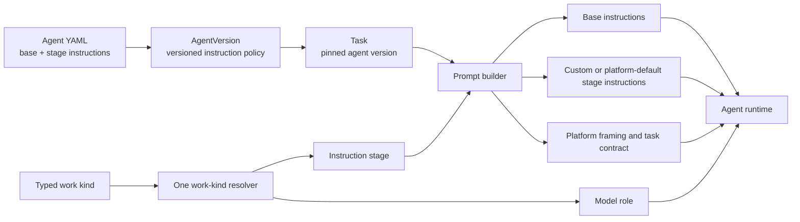

# 34. Stage-specific agent instructions

> **Status: proposed (2026-07-10).** Add optional instructions for each kernel stage while
> keeping agent-wide instructions and platform task contracts.

## 34.1 Problem

An agent has one `instructions` string today. Marathon applies that string to every task the
agent performs. This works for an agent with one role. It is less precise for Forge, which
drafts design documents, reviews changes, builds code, and responds to code review.

The shared string creates three problems:

- Every task receives rules for unrelated work. A build task receives document-writing rules.
- Rules for different stages can conflict. A document rule can affect a code response.
- Operators must write conditions such as "when drafting." The runtime knows the current work
  kind, but the configuration cannot use it.

Marathon also has separate hardcoded personas for draft, revision, and review work. These are
`DRAFT_PERSONA`, `REVISE_PERSONA`, and `REVIEW_PERSONA` in the GitHub handler. The prompt builder
uses them as `basePersona` fallbacks. It replaces a fallback when the task has an
`AgentVersion`. This creates two instruction systems with different override rules.

The existing `instructions` field should remain. It defines the agent's identity and rules that
apply to all work. Marathon needs one stage layer for rules that apply to the current role.

## 34.2 Solution overview

Add an optional `stage_instructions` mapping to each YAML agent specification. Its keys are the
four existing kernel stages: `draft`, `design-review`, `build`, and `code-review`.

Store the mapping on `AgentVersion`. Pin an agent version when a task is created. Resolve one
stage from a typed work kind. Use that stage for both instruction selection and model selection.
The prompt builder loads the base instructions and the effective instructions for that stage.

Move the existing hardcoded personas into platform default stage instructions. An agent's stage
value replaces the platform default for that stage. Platform safety framing and task contracts
remain separate. Surface text and document content remain untrusted input.



A dedicated agent with one role may continue to place all rules in `instructions`. An agent with
several roles can define only the stages that need custom rules.

## 34.3 Solution details

### 34.3.1 Shared stage type and package boundary

Use the existing four kernel names. Move `KERNEL_EVENTS` and `KernelEvent` from
`@marathon/config` to `@marathon/core`. Add a `config -> core` dependency. Re-export both symbols
from `@marathon/config` so current imports keep working.

This direction preserves the dependency boundary. The core `AgentVersion` type needs the stage
type. `@marathon/core` must not depend on the higher-level configuration package.

```ts
export const KERNEL_EVENTS = ["draft", "design-review", "build", "code-review"] as const;
export type KernelEvent = (typeof KERNEL_EVENTS)[number];
export type StageInstructions = Partial<Record<KernelEvent, string>>;
```

The model policy already accepts open role keys under `models`. Stage instructions use a closed
set instead. This difference is deliberate. Model gateways may define extra routing roles.
Prompt assembly has four supported execution stages, and an unknown stage cannot be selected by
the runtime. Rejecting it catches spelling errors during startup.

### 34.3.2 YAML configuration

Keep `instructions` as a required string. Add `stage_instructions` as an optional mapping.

```yaml
name: forge

instructions: |
  You are Forge. Follow the task contract. Use short, direct sentences.

stage_instructions:
  draft: |
    Write each design document in this order:
    1. Problem
    2. Solution overview
    3. Solution details

    Use concrete nouns and verbs.
    Remove vague modifiers and promotional language.
    Include a Mermaid or ASCII diagram only when it clarifies a component
    relationship, sequence, or data flow. Otherwise omit diagrams.

  build: |
    Implement the approved design.
    Keep the code change within the approved scope.
```

The parser must:

- Reject `stage_instructions` when the node is a scalar, list, or null.
- Accept only `draft`, `design-review`, `build`, and `code-review` entries.
- Reject an unknown entry key.
- Require each entry value to be a nonempty string after trimming.
- Reject a list, mapping, null, or blank string as an entry value.
- Trim each valid value once during parsing.
- Default to an empty mapping when `stage_instructions` is absent.

```ts
export interface AgentSpec {
  instructions: string;
  stageInstructions: StageInstructions;
  // Existing fields remain unchanged.
}
```

YAML parsing is a trust boundary. Narrow the mapping and each string there. Do not add type
assertions to instruction selection or prompt assembly.

### 34.3.3 Work-kind resolution

The stage describes the role the agent performs. It does not describe the event that caused the
task. Author revisions therefore use the author stage.

| Work kind | Instruction stage and model role |
| --- | --- |
| `doc_draft` | `draft` |
| `design_revision` | `draft` |
| `design_review` | `design-review` |
| `implementation` | `build` |
| `code_revision` | `build` |
| `code_review` | `code-review` |
| General chat or an unknown kind | no stage; model `default` |

Add one typed resolver for this table. Prompt assembly and `resolveModelRef` must consume its
result. Do not maintain separate stage literals for prompts and models.

```ts
export type AgentWorkKind =
  | "doc_draft"
  | "design_revision"
  | "design_review"
  | "implementation"
  | "code_revision"
  | "code_review";

export function stageForWorkKind(kind: AgentWorkKind): KernelEvent {
  // Exhaustive switch over the table above.
}
```

Most queued tasks already carry these values in `sourceRef.kind`. The GitHub initial-draft path
retains the surface kind (`issue` or `pr`), so that handler passes the typed `doc_draft` work kind
to the same resolver. No path may infer a work kind from free-form task text.

This resolver changes current revision model routing. Code revisions currently use the
`code-review` model role, and document revisions use `design-review`. After this change, producer
revisions use `build` and `draft`. The actual reviewer tasks continue to use `code-review` and
`design-review`. This makes model and instruction configuration use the same meaning for each
key.

### 34.3.4 Version storage and task pinning

Add a JSON column to `agent_version`:

```sql
alter table agent_version
  add column stage_instructions jsonb not null default '{}'::jsonb;
```

Add `stageInstructions: StageInstructions` to the core `AgentVersion` type. The database row
mapper must validate that the JSON value is an object with known keys and string values. Invalid
stored data must fail at the mapper.

Agent seeding compares both the composed base instructions and the stage mapping. A change to
either value publishes a new `AgentVersion`.

Current prompt assembly does not honor `task.agentVersionId`. It always loads the latest version
for `task.agentId`. The invocation router also creates new tasks without an agent-version pin.
Pinned loading is new work in this design.

The new flow is:

1. Agent seeding returns the current agent version identifier for each configured agent.
2. The invocation router stores that identifier in `task.agent_version_id`.
3. Prompt assembly loads that exact `AgentVersion` through a new by-id database lookup.
4. A chained task inherits a non-null version identifier from its source task.
5. If a legacy source task has a null version, the new chained task pins the latest version at
   chain-creation time.
6. A legacy task that is already running with a null version keeps the latest-version fallback.

Implementation and code-revision tasks already copy a source task's version when it is present.
Design-revision task creation does not. Update that path to set both `sourceTaskId` and
`agentVersionId`. This closes the design-revision gap.

Tasks created after rollout remain on one version across restarts. Legacy tasks with a null pin
cannot gain this guarantee retroactively. Their behavior is an explicit compatibility exception.

### 34.3.5 Platform default stage instructions

Replace the hardcoded stage personas with one platform default mapping:

```ts
const DEFAULT_STAGE_INSTRUCTIONS: Readonly<Record<KernelEvent, string>> = {
  draft: "Draft or revise a concise markdown design document that fulfills the request.",
  "design-review": "Review the design document and report one verdict.",
  build: DEFAULT_BUILD_INSTRUCTIONS,
  "code-review": "Review the code change and report one verdict.",
};
```

The exact text should preserve the current delivery behavior. Task contracts still contain tool
names, required arguments, and exactly-once rules.

Selection uses these rules:

1. Use the pinned agent version's value when it defines the selected stage.
2. Otherwise use the platform default for the selected stage.
3. Use no stage block for general chat.

Remove `DRAFT_PERSONA`, `REVISE_PERSONA`, and `REVIEW_PERSONA` from the GitHub handler. Remove the
stage-specific `basePersona` option and its call-site values. Keep a general fallback persona only
for a task with no agent version and no configured base instructions.

This gives stage guidance one source and one override rule. A custom stage value replaces the
platform default. It does not append to it.

### 34.3.6 Prompt assembly and precedence

Extend `buildAgentPrompt` with a typed work kind or resolved stage. Prefer the work kind at public
call boundaries and resolve it through `stageForWorkKind`.

The trusted instruction string uses this order:

1. The pinned `AgentVersion.instructions` value.
2. The custom or platform-default instructions for the selected stage.
3. Marathon's untrusted-content framing.
4. Marathon's task contract, when present.

The task contract stays last and states that it is authoritative. Custom instructions cannot
change tool grants, repository limits, approval rules, or delivery requirements. Code and the
Tool Gateway enforce those limits.

The context and invocation layers do not change. Memory, surface messages, documents, and the
request remain fenced as untrusted data.

### 34.3.7 Runtime wiring

Resolve instructions per task from the pinned `AgentVersion`. Do not cache resolved instruction
policy in `AgentRuntimeEntry`; that entry is built at startup and would conflict with task pins.

The build runner already has `db`. Remove the `instructions: spec.instructions` option passed in
`packages/github-app/src/build.ts`. Have the build runner call the same pinned-version resolver as
the document and review paths. `AgentRuntimeEntry` remains responsible for runtime, subscription,
and model policy only.

Each request path supplies an `AgentWorkKind` or a typed task that already contains one. The
shared resolver selects both the stage block and model role.

### 34.3.8 Prompt version

This design amends the `prompt_version` definition in §7.18. The selected instruction stage is a
prompt-version input because one `AgentVersion` can produce four different trusted instruction
strings.

Production code does not populate `prompt_version` today. This feature starts with the smallest
identifier that distinguishes the instruction source:

```text
<agent-version-id>:<stage-or-none>
```

Do not add prompt-builder or task-contract constants in this change. Those artifacts are not
versioned in production. When output/template and builder versioning from §7.18 are implemented,
extend the identifier instead of creating a second definition.

### 34.3.9 Compatibility and rollout

The YAML change is additive:

- Existing YAML files remain valid.
- The existing `instructions` value remains required.
- Existing database rows receive an empty mapping through the migration default.
- Old tasks with no pinned version retain the latest-version fallback.

Prompt behavior changes in two stated ways:

- A configured agent with no custom stage value receives the platform default for that stage.
  This replaces the current behavior where `AgentVersion.instructions` removes the hardcoded
  fallback persona.
- Producer revisions use the `draft` or `build` model role. They no longer use reviewer roles.

Call out both changes in release notes. Deployments that set revision-specific reviewer model
keys should move those choices to `models.draft` or `models.build`.

The local override behavior does not change. A `<name>.local.yaml` file replaces the full
committed specification for that agent. It must repeat any stage instructions it wants to keep.

### 34.3.10 Validation versus guidance

Stage instructions guide model output. They do not prove that the output follows a format.

Requirements that must never be violated belong in code. Examples include tool grants, allowed
repositories, and the requirement to call `document_create`. Formatting preferences belong in
stage instructions and evaluations. A deployment may add a document validator for an exact
heading order or an explicit forbidden-term list. Diagram usefulness remains a review criterion
because it depends on the document's content.

### 34.3.11 Testing

Configuration tests:

- Parse one or several stage values and trim them.
- Default to an empty mapping.
- Reject a scalar, list, or null `stage_instructions` node.
- Reject unknown entry keys and non-string or blank entry values.
- Load stage instructions from a local override.
- Keep existing `KernelEvent` imports working through the config re-export.

Version tests:

- Publish a new version when one stage changes.
- Reuse the current version when base and stage instructions match.
- Validate stored JSON in the row mapper.
- Pin the seeded version when the router creates a task.
- Load a task's version by id instead of latest.
- Pin latest at chain-creation time when a legacy source task has a null version.
- Propagate the pin and source task through design revisions.

Stage and model tests:

- Map every `AgentWorkKind` through one exhaustive resolver.
- Apply `draft` instructions and model routing to document revisions.
- Apply `build` instructions and model routing to code revisions.
- Keep reviewer tasks on `design-review` and `code-review`.
- Use the default model and no stage block for general chat.

Prompt tests:

- Add the selected custom stage block after base instructions.
- Use the platform default when the agent version omits the stage.
- Never append a platform default to a custom stage value.
- Remove the three GitHub-handler personas and stage-specific `basePersona` paths.
- Keep the platform contract after custom instructions.
- Keep all surface, memory, document, and request content in untrusted fences.
- Record distinct prompt versions for two stages on one agent version.

Integration tests:

- A multi-role Forge draft receives only Forge's `draft` block.
- A Forge build receives only Forge's `build` block.
- A dedicated reviewer receives its own review-stage block.
- A task keeps its pinned instructions after a new YAML version is seeded.

### 34.3.12 Implementation sequence

1. Move the kernel event type to core and re-export it from config.
2. Add the typed configuration field and parser tests.
3. Add the database column, core type, and validated row mapping.
4. Store the field during agent seeding and pin the version during task routing.
5. Add the work-kind resolver and use it for prompts and models.
6. Replace hardcoded personas with platform default stage instructions.
7. Resolve instructions per task in document, review, and build paths.
8. Populate the stage-aware prompt version and add integration tests.
9. Add Forge stage instructions as a separate configuration change.

### 34.3.13 Acceptance criteria

- Each configured agent may define zero or more stage instruction blocks.
- A task receives no more than one stage block.
- One typed mapping selects both instruction stage and model role.
- Document and code revisions use producer stages.
- Custom stage instructions replace platform defaults for that stage.
- Platform contracts remain present and authoritative.
- Existing agent YAML works without changes.
- A stage-instruction change creates a new agent version.
- Tasks created after rollout keep their pinned version across restarts.
- Legacy null-version behavior is explicit and tested.
- Unit and integration tests keep repository coverage at or above 90%.

### 34.3.14 Non-goals

- Arbitrary user-provided instructions in Slack or GitHub messages.
- Per-task instruction editing through the console.
- A template language inside YAML.
- Conditional rules based on model output or tool results.
- Hard enforcement of subjective writing preferences.
- Changes to tool permissions, approval policy, or sandbox policy.
